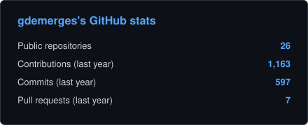
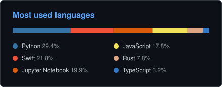

<h1 align="center">Hello, I'm Guillaume 👋</h1>

<i>Data Engineer · AI · Data Pipelines</i>

I build production data pipelines and RAG architectures, from ingestion to cloud deployment.

  
  

### About me

Data Engineer passionate about AI, automation and data pipelines.
Currently building RAG architectures and data infrastructure at [CNAF](https://www.caf.fr), while studying for a Mastère Data Engineer at Ynov.
I love designing end-to-end systems — from web scraping and ETL to vector search and cloud deployment.

### Tech Stack

### Projects

| Project | Stack | What it does |
|:--------|:------|:-------------|
| [**Benji**](https://github.com/gdemerges/Benji) | Python · Whisper · Qt | Real-time on-device speech-to-text subtitles, overlaid on screen. Optimized for Apple Silicon (Whisper via MLX) |
| [**Wello**](https://github.com/gdemerges/wello-ios) | Swift · SwiftUI · HealthKit | Hydration tracker whose daily goal is computed from HealthKit activity, weather and medical context. 100% on-device |
| [**WhatsApp Wrapped**](https://github.com/gdemerges/wrapped_whatsapp) | Vanilla JS · Chart.js | Spotify-Wrapped-style analytics for your WhatsApp chats, 100% client-side |
| [**EcoDiet**](https://github.com/gdemerges/ecodiet_ios) | Swift · AI | Data- and AI-powered nutrition recommender |

### Activity

  <picture>
    <source media="(prefers-color-scheme: light)" srcset="stats-light.svg" />
    <source media="(prefers-color-scheme: dark)" srcset="stats.svg" />
    
  </picture>
  <picture>
    <source media="(prefers-color-scheme: light)" srcset="languages-light.svg" />
    <source media="(prefers-color-scheme: dark)" srcset="languages.svg" />
    
  </picture>

### Beyond Tech

When I'm not coding, you'll probably find me:
- 🏃 Training for my next race (currently the Run in Lyon half marathon)
- 🎸 At concerts and music festivals, metal & techno
- 📚 Reading Isaac Asimov or diving into sci-fi classics
